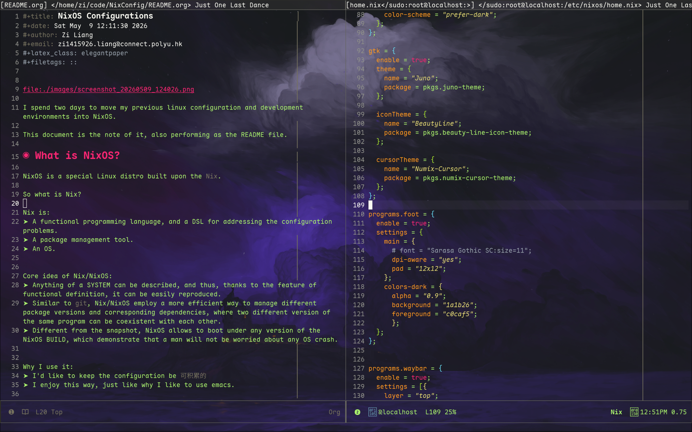
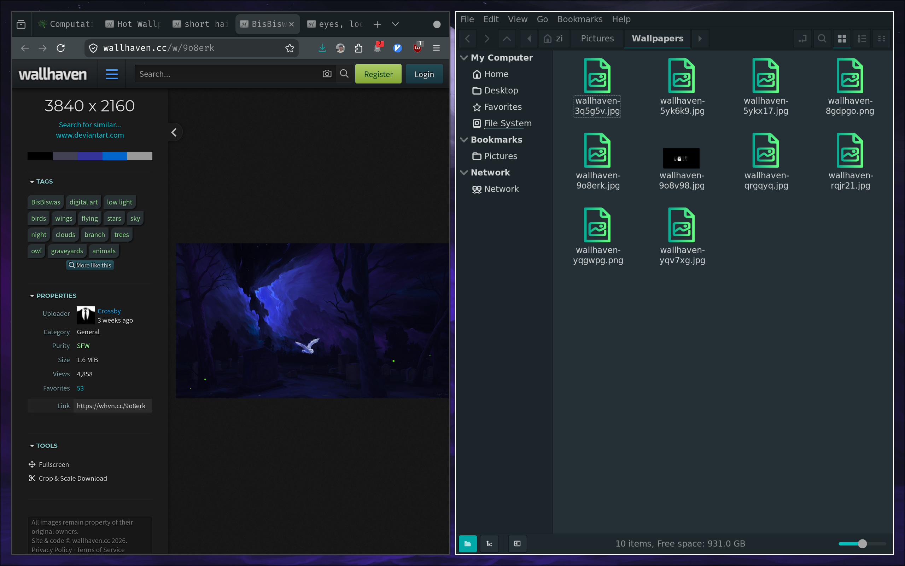
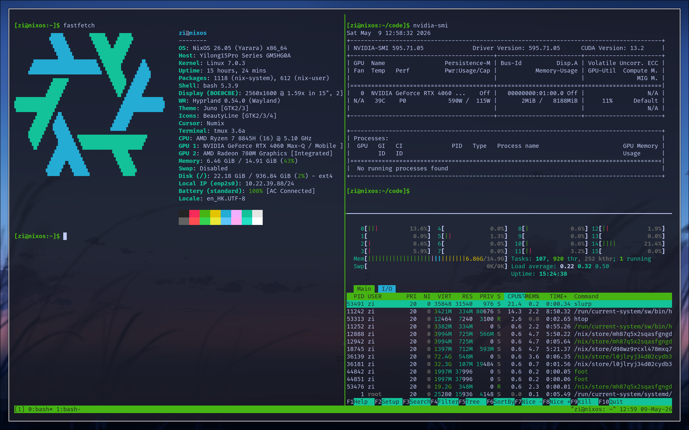

#+title: NixOS Configurations
#+date: Sat May  9 12:11:30 2026
#+author: Zi Liang
#+email: zi1415926.liang@connect.polyu.hk
#+latex_class: elegantpaper
#+filetags: ::

[[file:./images/screenshot_20260509_125220.png]]

I spent two days to move my previous linux configuration and development environments into NixOS.

This document is the note of it, also performing as the README file.

* What is NixOS?

NixOS is a special Linux distro built upon the =Nix=.

So what is Nix?

Nix is:
+ A functional programming language, and a DSL for addressing the configuration problems.
+ A package management tool.
+ An OS.

Core idea of Nix/NixOS:
+ Anything of a SYSTEM can be described, and thus, thanks to the feature of functional definition, it can be easily reproduced.
+ Similar to =git=, Nix/NixOS employ a more efficient way to manage different package versions and corresponding dependencies, where two different version of the same program can be coexistent with each other.
+ Different from the snapshot, NixOS allows to boot under any version of the NixOS BUILD, which demonstrate that a man will not be worried about any OS crash.

Why I use it:
+ I'd like to keep the configuration be =可积累的=
+ I enjoy this way, just like why I like to use emacs.

* What This Configuration Contains?

This configuration contains a *minimal* configuration of my new desktop environment.

It is a TTY environment by default, BUT providing a very beautiful and robust and convenient DESKTOP development environment.

The schema as list below:

|----------------+------------------|
| Component      | Solution         |
|----------------+------------------|
| System         | NixOS (26.05)    |
| Use Flake?     | Yes              |
| Default OS Env | TTY              |
| Desktop Env    | Wayland          |
| Desktop        | Hyprland         |
| Launcher       | wofi             |
| Status Bar     | waybar           |
| Terminal       | foot*            |
| File Manager   | nemo*            |
| Notifications  | dunst/libnotify  |
| GTK            | juno-theme       |
| Icon           | beauty-line-icon |
| Capture        | grim/slurp       |
| Wallpaper      | awww             |
| Editor         | emacs/vim        |
| Agent          | opencode         |
|----------------+------------------|

Note: This list will keep increase and changed dynamically.

** Necessary Packages

** For Chinese Users

+ IM: I use =wechat-uos= and =qq=
+ Input Method: =fcitx5= with =pinyin= -- 很好用的！
+ Office: WPS (What can I say?)

** For Emacs Users

Surely it is =emacs-overlay=

* Repository Structure

#+begin_src text
nix-config/
├── flake.nix                 # Entry point — defines inputs and NixOS config
├── flake.lock                # Pinned input versions
├── bootstrap.sh              # Install / apply / build-ISO
├── hosts/
│   └── nixos/
│       ├── configuration.nix # System-level config (boot, users, packages)
│       ├── hardware-configuration.nix
│       └── home.nix          # User-level config (packages, env, dotfiles)
├── modules/
│   ├── system/               # Reusable system modules
│   │   ├── hyprland.nix
│   │   ├── nvidia.nix
│   │   ├── fonts.nix
│   │   ├── input-method.nix
│   │   ├── pipewire.nix
│   │   ├── portal.nix
│   │   └── kanata.nix
│   └── home/                 # Reusable home-manager modules
│       ├── emacs.nix
│       ├── waybar.nix
│       ├── foot.nix
│       └── gtk.nix
└── dotfiles/                 # Configuration files managed by home-manager
    ├── hypr/hyprland.conf
    └── wofi/{config,style.css}
#+end_src

* Getting Started

** On an Existing NixOS Machine

#+begin_src bash
  git clone https://github.com/YOUR_USERNAME/nix-config.git ~/code/NixConfig
  sudo nixos-rebuild switch --flake ~/code/NixConfig#nixos
#+end_src

Or use the bootstrap script:

#+begin_src bash
  ./bootstrap.sh apply
#+end_src

** Fresh Install (from NixOS ISO)

#+begin_src bash
  # 1. Partition disks and mount to /mnt
  # 2. Run the installer
  ./bootstrap.sh install
#+end_src

This will generate a hardware config for the new machine, clone the repo,
and run =nixos-install --flake=.

* Hyprland Keybindings

All keybindings are defined in [[./dotfiles/hypr/hyprland.conf][dotfiles/hypr/hyprland.conf]]

| Key                     | Action                           |
|-------------------------+----------------------------------|
| =Super + arrows=        | Move focus                       |
| =Super + Tab=           | Cycle windows                    |
| =Super + 1-0=           | Switch to workspace 1-10         |
| =Super + Shift + 1-0=   | Move window to workspace 1-10    |
| =Super + K=             | Kill active window               |
| =Super + V=             | Toggle floating                  |
| =Super + F=             | Toggle fullscreen                |
| =Super + R=             | Enter resize mode (arrows / HJKL)|
| =Super + T=             | Open terminal (=foot=)           |
| =Super + X=             | Open launcher (=wofi=)           |
| =Super + E=             | Open file manager (=nemo=)       |
| =Super + L=             | Lock screen (=swaylock=)         |
| =Super + Q=             | Quit Hyprland                    |
| =Super + Alt + arrows=  | Move window                      |
| =Ctrl + Alt + T=        | Open terminal (alternative)      |
| =Print=                 | Screenshot region to clipboard   |

* Keyboard Remap

=CapsLock= is remapped to =Control= via [[https://github.com/jtroo/kanata][kanata]] (configured in [[./modules/system/kanata.nix][modules/system/kanata.nix]]).

Set =services.kanata.enable = false= in the module if you do not need this.

* Notes

** Super+L and logind

Systemd-logind intercepts =Super+L= by default. This config adds
=services.logind.settings= to ignore those hardware keys and let Hyprland
handle them. See [[./hosts/nixos/configuration.nix][configuration.nix]] for the relevant block.

** Steam

Steam is enabled at the system level: =programs.steam.enable = true=.
This automatically installs all required 32-bit libraries and the Steam
package itself — no need to add =steam= to a package list.

** Swaylock PAM

=Swaylock= is configured as a PAM service (=security.pam.services.swaylock=)
so it can unlock the screen without requiring a password policy override.
